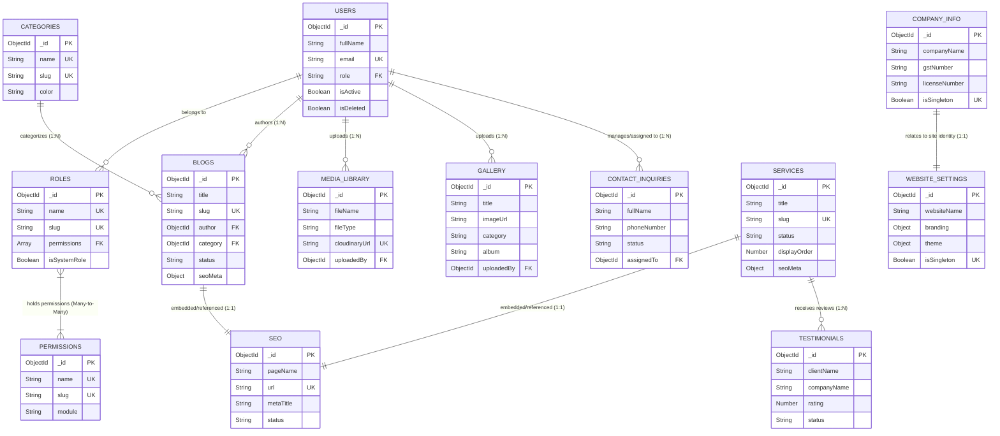

# Enterprise Database Entity Relationship (ER) Diagram
**Architecture Standard**: MongoDB / Mongoose Data Relationship Model  
**Architect**: Senior Database Architect  

---

## 📐 Entity Relationship (ER) Diagram

---

## 🔗 Comprehensive Relationship Definitions Matrix

### 1. Many-to-Many (N:M) Relationships

- **Roles ↔ Permissions**:
  - **Type**: `Many-to-Many`
  - **Implementation**: Array of `Permission` ObjectIds in `Role.permissions` (`[{ type: Schema.Types.ObjectId, ref: 'Permission' }]`).
  - **Description**: A `Role` contains multiple permissions, and a `Permission` can be reused across multiple roles (e.g., `Super Admin`, `Admin`, `Editor`).

---

### 2. One-to-Many (1:N) Relationships

- **Users → Blogs**:
  - **Type**: `One-to-Many`
  - **Foreign Key**: `Post.author` (`ref: 'User'`).
  - **Description**: One authoring `User` can write multiple `Blogs`, but each blog has a single primary author.

- **Categories → Blogs**:
  - **Type**: `One-to-Many`
  - **Foreign Key**: `Post.category` (`ref: 'Category'`).
  - **Description**: One `Category` organizes multiple `Blogs`.

- **Users → Media Library**:
  - **Type**: `One-to-Many`
  - **Foreign Key**: `MediaLibrary.uploadedBy` (`ref: 'User'`).
  - **Description**: One `User` can upload multiple assets to the `Media Library`.

- **Users → Gallery**:
  - **Type**: `One-to-Many`
  - **Foreign Key**: `Gallery.uploadedBy` (`ref: 'User'`).
  - **Description**: One `User` can upload multiple images to the `Gallery`.

- **Users → Contact Inquiries**:
  - **Type**: `One-to-Many`
  - **Foreign Key**: `ContactInquiry.assignedTo` (`ref: 'User'`).
  - **Description**: One staff `User` can be assigned to manage multiple `Contact Inquiries`.

- **Services → Testimonials**:
  - **Type**: `One-to-Many`
  - **Foreign Key**: Virtual / Implicit linkage via `vehicleScrapped` or optional `serviceId`.
  - **Description**: A single `Service` receives reviews from multiple `Testimonials`.

---

### 3. One-to-One (1:1) & Embedded Relationships

- **Blogs → SEO Payload**:
  - **Type**: `One-to-One` (Embedded schema object `post.seoMeta`).
  - **Description**: Each `Blog` post owns a unique SEO payload (`metaTitle`, `metaDescription`, `keywords`, `canonicalUrl`).

- **Services → SEO Payload**:
  - **Type**: `One-to-One` (Embedded schema object `service.seoMeta`).
  - **Description**: Each `Service` owns a unique SEO payload.

- **Company Info → Website Settings**:
  - **Type**: `One-to-One` (Singleton pairing).
  - **Description**: The platform maintains exactly 1 global `Company Info` document linked to 1 global `Website Settings` document via `{ isSingleton: true }`.
